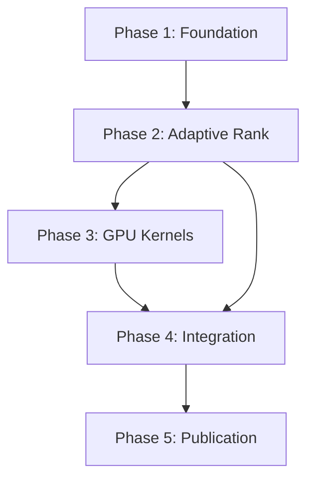

# AdaAttn - Project Plan

## Project Overview

**AdaAttn** (Adaptive Precision & Rank Attention) is a GPU-native attention mechanism designed to dynamically adapt numerical precision and matrix rank at runtime, reducing memory bandwidth and computational overhead in large language models without sacrificing model quality.

### Core Research Questions

1. Can attention matrices be **approximated dynamically** based on entropy or rank structure?
2. Can we **change precision mid-kernel** without hurting stability?
3. How much **memory bandwidth** can be saved vs FlashAttention?
4. When does adaptive rank outperform static approximations?

---

## Phase 1: Foundation & Literature Review (Months 1-2)

**Status**: 🟡 In Progress | **Priority**: 🔴 Critical

### Objectives
- [ ] **1.1 Literature Review**: Complete comprehensive review of attention optimization papers
  - Options: Focus on FlashAttention, Linear Attention, Sparse Attention
  - Action: Create annotated bibliography in `docs/related_work.md`
  - Deliverable: Literature review document with key insights

- [ ] **1.2 FlashAttention Baseline**: Implement and profile FlashAttention v2 baseline
  - Options: Use official repo, implement from scratch, use Triton version
  - Action: Set up benchmarking infrastructure
  - Deliverable: Working baseline with profiling metrics

- [ ] **1.3 Repository Scaffolding**: Complete project structure and CI setup
  - Options: Poetry vs pip, GitHub Actions vs local testing
  - Action: Finalize all configuration files
  - Deliverable: Fully configured repository

- [ ] **1.4 Development Environment**: Docker-based reproducible environment
  - Options: NVIDIA NGC container, custom Dockerfile, conda
  - Action: Create and test Docker environment
  - Deliverable: Working Docker image with all dependencies

- [ ] **1.5 Testing Infrastructure**: Set up pytest with GPU markers
  - Options: pytest-benchmark, custom timing decorators
  - Action: Create test fixtures for attention operations
  - Deliverable: Test suite with baseline tests passing

### Milestones
| Milestone | Target Date | Completion Criteria |
|-----------|-------------|---------------------|
| Lit review done | Week 2 | 20+ papers reviewed |
| Baseline running | Week 4 | FlashAttention benchmarks complete |
| Repo ready | Week 4 | All CI/tooling configured |

---

## Phase 2: Adaptive Rank Heuristics (Months 3-4)

**Status**: ⭕ Not Started | **Priority**: 🔴 Critical

### Objectives
- [ ] **2.1 Entropy Estimation**: Implement efficient entropy computation for attention
  - Options: Exact computation, sampling-based, proxy metrics
  - Action: Research and implement in `src/adaattn/linalg/entropy.py`
  - Deliverable: Validated entropy estimation module

- [ ] **2.2 Rank Estimation**: Develop spectral norm and rank proxy methods
  - Options: Power iteration, randomized SVD, Hutchinson trace estimator
  - Action: Implement in `src/adaattn/linalg/low_rank.py`
  - Deliverable: Fast rank estimation utilities

- [ ] **2.3 Decision Logic**: Create rank selection heuristics
  - Options: Threshold-based, learned, entropy-adaptive
  - Action: Implement decision module in `src/adaattn/attention/adaptive_rank.py`
  - Deliverable: Working rank selection with configurable strategies

- [ ] **2.4 CPU Prototype**: Full Python prototype of adaptive rank attention
  - Options: Pure PyTorch, NumPy+PyTorch hybrid
  - Action: End-to-end implementation with tests
  - Deliverable: Correct adaptive rank attention (CPU)

- [ ] **2.5 Correctness Validation**: Comprehensive numerical testing
  - Options: Reference implementation comparison, gradient checks
  - Action: Create test suite in `tests/test_rank.py`
  - Deliverable: All correctness tests passing

### Milestones
| Milestone | Target Date | Completion Criteria |
|-----------|-------------|---------------------|
| Entropy module | Week 6 | Tests passing, benchmarked |
| Rank estimation | Week 8 | Validated against SVD |
| CPU prototype | Week 10 | End-to-end working |

---

## Phase 3: GPU Kernel Development (Months 5-6)

**Status**: ⭕ Not Started | **Priority**: 🔴 Critical

### Objectives
- [ ] **3.1 Triton Kernels**: Implement adaptive attention in Triton
  - Options: Triton 2.0+, custom autotuning
  - Action: Develop kernels in `src/adaattn/kernels/`
  - Deliverable: Working Triton implementation

- [ ] **3.2 Mixed Precision Kernels**: Add FP16/BF16/FP8 support
  - Options: Static precision, dynamic per-block
  - Action: Implement precision control logic
  - Deliverable: Multi-precision kernel support

- [ ] **3.3 Low-Rank GEMM**: GPU-optimized low-rank matrix operations
  - Options: cuBLAS batched, custom kernel, Triton
  - Action: Implement in `src/adaattn/kernels/adaptive/`
  - Deliverable: Optimized low-rank GEMM

- [ ] **3.4 PyTorch Bindings**: C++ extension bindings for Python
  - Options: torch.autograd.Function, cpp_extension
  - Action: Create bindings in `src/adaattn/kernels/bindings.cpp`
  - Deliverable: Seamless PyTorch integration

- [ ] **3.5 Profiling & Optimization**: NSight profiling and optimization
  - Options: NSight Compute, NSight Systems, custom timers
  - Action: Profile and optimize hot paths
  - Deliverable: Optimized kernels with profiling reports

### Milestones
| Milestone | Target Date | Completion Criteria |
|-----------|-------------|---------------------|
| Triton kernels | Week 14 | Correct output, GPU tested |
| Mixed precision | Week 16 | FP16/BF16 working |
| PyTorch bindings | Week 18 | pip installable |

---

## Phase 4: Integration & Benchmarking (Months 7-8)

**Status**: ⭕ Not Started | **Priority**: 🟠 High

### Objectives
- [ ] **4.1 Full AdaAttn Module**: Unified attention module combining all features
  - Options: Single class, modular composition
  - Action: Implement in `src/adaattn/attention/adaattn.py`
  - Deliverable: Drop-in attention replacement

- [ ] **4.2 Transformer Integration**: Test with GPT-style models
  - Options: HuggingFace integration, custom wrapper
  - Action: Create model wrappers in `src/adaattn/models/`
  - Deliverable: Working transformer with AdaAttn

- [ ] **4.3 Ablation Studies**: Systematic component analysis
  - Options: Rank only, precision only, combined
  - Action: Design and run experiments in `experiments/ablations/`
  - Deliverable: Ablation study results

- [ ] **4.4 Benchmark Suite**: Compare against baselines
  - Options: FlashAttention v2, xFormers, PyTorch SDPA
  - Action: Implement benchmarks in `benchmarks/`
  - Deliverable: Comprehensive benchmark report

- [ ] **4.5 Quality Validation**: Perplexity and downstream task testing
  - Options: WikiText, LAMBADA, custom datasets
  - Action: Run quality experiments
  - Deliverable: Quality metrics documentation

### Milestones
| Milestone | Target Date | Completion Criteria |
|-----------|-------------|---------------------|
| AdaAttn module | Week 22 | All tests passing |
| Benchmarks complete | Week 24 | vs FlashAttention comparison |
| Ablations done | Week 26 | Results documented |

---

## Phase 5: Documentation & Publication (Months 9-10)

**Status**: ⭕ Not Started | **Priority**: 🟡 Medium

### Objectives
- [ ] **5.1 Thesis Writing**: Complete academic thesis document
  - Options: LaTeX, Markdown + Pandoc
  - Action: Draft all chapters
  - Deliverable: Complete thesis draft

- [ ] **5.2 Paper Draft**: NeurIPS/ICML style paper
  - Options: 8-page conference, workshop paper
  - Action: Write paper with results
  - Deliverable: Submission-ready paper

- [ ] **5.3 API Documentation**: Sphinx documentation
  - Options: Sphinx, MkDocs, pdoc
  - Action: Document all public APIs
  - Deliverable: Published documentation

- [ ] **5.4 Tutorial & Examples**: Usage tutorials
  - Options: Jupyter notebooks, scripts
  - Action: Create tutorials in `examples/`
  - Deliverable: Comprehensive examples

- [ ] **5.5 Open Source Release**: Public repository preparation
  - Options: GitHub release, PyPI package
  - Action: Final cleanup and release
  - Deliverable: v1.0.0 release

### Milestones
| Milestone | Target Date | Completion Criteria |
|-----------|-------------|---------------------|
| Thesis draft | Week 32 | All chapters written |
| Paper submitted | Week 36 | Conference submission |
| v1.0 release | Week 40 | Public release |

---

## Progress Tracking

### Overall Status

| Phase | Status | Completion | Target Date |
|-------|--------|------------|-------------|
| Phase 1: Foundation | 🟡 In Progress | 20% | Month 2 |
| Phase 2: Adaptive Rank | ⭕ Not Started | 0% | Month 4 |
| Phase 3: GPU Kernels | ⭕ Not Started | 0% | Month 6 |
| Phase 4: Integration | ⭕ Not Started | 0% | Month 8 |
| Phase 5: Publication | ⭕ Not Started | 0% | Month 10 |

### Legend
- **Completion Status**: ✅ Complete, 🟡 In Progress, ⭕ Not Started, ❌ Blocked, 🔄 Needs Review
- **Priority Levels**: 🔴 Critical, 🟠 High, 🟡 Medium, 🟢 Low

---

## Baselines to Compare Against

| Baseline | Implementation | Key Metric |
|----------|----------------|------------|
| PyTorch SDPA | `torch.nn.functional.scaled_dot_product_attention` | Baseline speed |
| FlashAttention v2 | Official CUDA kernels | Speed champion |
| xFormers | Meta's memory-efficient attention | Memory efficiency |
| Linear Attention | Performer-style | Theoretical comparison |
| Mamba | State-space models | Alternative architecture |

---

## Risk Assessment

| Risk | Likelihood | Impact | Mitigation |
|------|------------|--------|------------|
| CUDA kernel bugs | Medium | High | Extensive testing, reference comparisons |
| Precision instability | Medium | High | Error bounds, fallback to higher precision |
| No speedup vs FlashAttn | Low | Critical | Focus on memory reduction if speed similar |
| GPU memory constraints | Medium | Medium | Stream processing, gradient checkpointing |

---

## Dependencies

